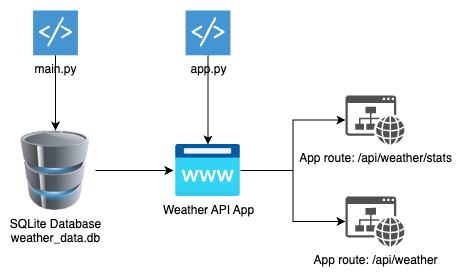
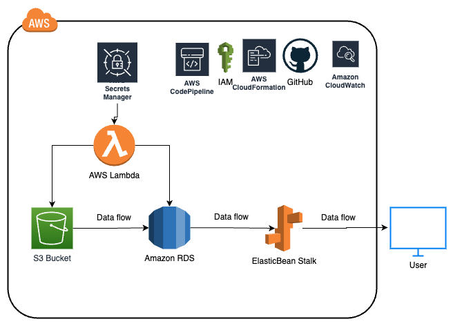

# Technical Documentation on Weather API App Coding challenge

## Introduction
This technical documentation provides an overview of Weather API App. The data ingestion and API setup process for a weather data application. The main.py file handles the setup of the database and data ingestion, while the app.py file sets up the APIs for accessing the weather data.

## Architecture Diagram

## Code Files
### main.py
This file is responsible for setting up the SQLite database and ingesting weather data into it.

#### Dependencies
sqlite3: The sqlite3 module is imported to work with the SQLite database.
glob: The glob module is used to retrieve a list of .txt files in a specified path.
time: The time module is used for timestamping and tracking the data ingestion process.
logging: The logging module is used for logging information related to the data ingestion process.

Setup and Data Ingestion
Logging is set up by configuring a log file named data_ingestion.log.

A list of .txt files in a specific path is obtained using the glob module.

The SQLite database is connected to using sqlite3.connect() with the database file name.

The existence of the WeatherData table is checked. If it doesn't exist, the table is created with necessary columns and indexes.

The current insert date is obtained using time.strftime().
The data ingestion process begins by iterating over each file in the file list.

For each file, the station ID is extracted from the file name.
The lines in the file are read, and each line is processed to extract data.

The extracted data is inserted into the WeatherData table using SQL statements.
The total number of records ingested is tracked.

Once the data ingestion process is complete, the end time is logged along with the total number of records ingested.
The WeatherStatistics table is created if it doesn't exist, along with necessary columns and indexes.

Weather statistics are calculated and stored in the WeatherStatistics table using SQL statements.

The calculated statistics include average maximum temperature, average minimum temperature, and total precipitation for each unique combination of year and station ID.

### app.py
This file sets up the Flask application and defines APIs for accessing the weather data.

#### Dependencies
sqlite3: The sqlite3 module is imported to work with the SQLite database.
Flask: The Flask module is used to create and configure the Flask application.

request: The request module is used to handle incoming requests and retrieve query parameters.

jsonify: The jsonify module is used to convert Python objects to JSON format.

API Setup
The Flask application is created using Flask(__name__).

The Swagger UI is configured using the get_swaggerui_blueprint() function from flask_swagger_ui.
The Swagger UI blueprint is registered with the Flask application using app.register_blueprint().

The /api/weather endpoint is defined with the GET method to retrieve weather data from the WeatherData table based on provided query parameters.

The /api/weather/stats endpoint is defined with the GET method to retrieve weather statistics data from the WeatherStatistics table based on provided query parameters.

The get_weather() function handles the /api/weather endpoint request.
The get_weather_stats() function handles the /api/weather/stats endpoint request.
Within these functions, the SQLite database is connected to, and query parameters are retrieved from the request.
The appropriate SQL query is constructed based on the provided query parameters.
The query is executed, and the resulting rows are fetched.
The fetched data is converted to a list of dictionaries using a sqlite3.Row object.

The JSON response is generated using jsonify() and returned.
Running the Application
The Flask application is run using app.run() with debug mode enabled and on port 8000.

### unittest_app.py

This file contains unit test cases that verify the functionality of the Flask application and its API endpoints.

The test cases validate the behavior and correctness of the API endpoints by simulating requests and asserting expected response values. 

#### Dependencies
unittest: The unittest module is imported to create test cases and assertions.
Flask: The Flask module is imported to create a test Flask application.
app: The app module is imported to access the application's API functions.
#### Test Case Class
AppTestCase is a subclass of unittest.TestCase and serves as the test case class.
#### Test Setup
The setUp() method is called before each test case to set up the test environment.
An instance of the Flask application is created using Flask(__name__).
The test client is created using self.app.test_client().
#### Test Cases
test_get_weather()
This test case verifies the behavior of the /api/weather endpoint.
It simulates a request to the endpoint with specific query parameters using self.app.test_request_context().
The get_weather() function from app is called to handle the request and retrieve the response.
The response data is extracted using response.get_json().
Assertions are made to validate the response status code and the expected value of a specific data attribute.
test_get_weather_stats()
This test case verifies the behavior of the /api/weather/stats endpoint.
It simulates a request to the endpoint with specific query parameters using self.app.test_request_context().
The get_weather_stats() function from app is called to handle the request and retrieve the response.
The response data is extracted using response.get_json().
Assertions are made to validate the response status code and the expected value of a specific data attribute.
#### Running the Tests
The test cases are executed by running unittest.main() at the end of the file.
The test runner executes all the test cases within the AppTestCase class.

You can use this command in the terminal: **python -m unittest unittest_app.py**

### weather_data.db

It is the SQLITE database files which containts the WeatherData and WeatherStatistics. Due to large size I was not able to add the file in github. However, You can download it from below link.

Database Schema Link: [Click here](docs/db_schema.pdf)

Database file link: [Click here](https://drive.google.com/file/d/1PsEuvXxUVQUC3ZCtlEy0HcQKyKF6d0Sg/view?usp=share_link)

### .pylintrc

It contains pylint rules.

You can use this command in the terminal for linting you code: **pylint uapp.py**

### data_ingestion.log
It contains data ingesation logs

### requirements.txt

It contains list of required modules

## Conclusion
The main.py file handles the setup of the SQLite database, data ingestion from .txt files, and weather statistics calculation. The app.py file sets up the Flask application and defines APIs for accessing weather data and statistics stored in the database. By following the provided documentation, you can run the application and access the weather data through the defined APIs.

## How to deploy this project in your system?

- Clone this repository
- Place the weather_data.db in the parent folder i.e codingtest_weather_data (Optional)
- execute the requirements.txt file
- execute the main.py and check the data_ingesation.log file for logs.
- execute the app.py file go to below links for querying data using APIs

Swagger Link: http://localhost:8000/swagger/#/default/get_api_weather_stats

Weather data API: http://localhost:8000/api/weather?date=19850101

Weather Stats API: http://localhost:8000/api/weather/stats?date=2000

## Deployment in AWS 

### Architecture Diagram

To deploy the API, database, and a scheduled version of the data ingestion code on AWS, I would use the following tools and AWS services:
1. AWS Elastic Beanstalk: I would use Elastic Beanstalk to deploy the Flask API. Elastic Beanstalk provides a fully managed platform for deploying and scaling web applications. It simplifies the deployment process and handles infrastructure provisioning, load balancing, and auto-scaling.
2. Amazon RDS (Relational Database Service): I would utilize Amazon RDS to host the SQLite database. RDS provides managed database services, making it easy to set up, operate, and scale a relational database in the cloud. I would choose an appropriate database engine supported by RDS, such as MySQL or PostgreSQL, instead of SQLite. Here I'll use AWS Secrets manager to store and rotate the db credentials of the RDS Database.

3. AWS Lambda/AWS Glue: To implement the scheduled version of the data ingestion code, I would use AWS Lambda. Lambda allows running code without provisioning or managing servers. I would write the data ingestion code as a Lambda function and enchance it by making the lambda function recursive. In this way I'll have multiple invocation for each files or station ID. I will also configure a scheduled event using AWS CloudWatch Events to trigger the function at the desired intervals. If the volumn of data is high then I will make use of AWS glue. Using glue we can eaily process the new data files by using glue job book marks.

4. AWS CloudFormation: I would use CloudFormation to define the infrastructure as code. I would create templates that specify the AWS resources required for the API, database, and Lambda function. CloudFormation provides a way to provision and manage the resources in a repeatable and automated manner.
5. AWS CloudWatch: I would utilize CloudWatch to monitor the deployed resources and set up alarms for key metrics. CloudWatch can provide insights into the health, performance, and logs of the deployed API, database, and Lambda function.
6. Amazon S3: If necessary, I would use Amazon S3 to store any static files or data required by the API or data ingestion process. S3 offers scalable object storage and can be used to store files, images, or other resources.
7. AWS Identity and Access Management (IAM): I would configure IAM to manage access to AWS resources. IAM allows creating roles and permissions to control who can deploy, access, and modify the API, database, Lambda function, and other resources.
8. Amazon Route 53: If a custom domain is required, I would use Route 53 to manage DNS and map the custom domain to the deployed API.

9. Using AWS service like codepiple, CloudFromation, CodeBuild, GitHub, etc. I will create a CICD pipeline and automate the deployment process with test driven approach.

The overall approach would involve setting up the Elastic Beanstalk environment to deploy the Flask API, configuring the Amazon RDS instance to host the database, creating an AWS Lambda function for the data ingestion code and scheduling it using CloudWatch Events. CloudFormation would be used to define the infrastructure resources, and CloudWatch would provide monitoring and alerting capabilities. IAM would be used to manage access to resources, and Route 53 could be used for custom domain configuration if needed.

